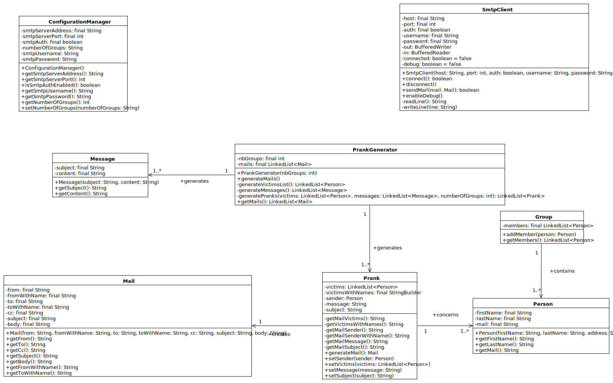

# Rapport labo 4 – SMTP

## Auteurs : Louis Hadrien, Mirabile Théo

# Table des matières


# Introduction et but

Ce repository contient la réalisation du laboratoire n°4 du cours d'API 2021. Le but de ce laboratoire est de mettre en pratique les connaissances acquises sur les
entrées / sorties en Java ainsi que se familiariser avec le protocole SMTP et Docker. Il est demandé de réaliser
un client SMTP permettant d'envoyer des emails forgés (pranks) à une liste de victimes tout en utilisant un serveur
de mocking SMTP pour les tests.

# Descriptif de l'implémentation

## Gestion de la configuration (classe `ConfigurationManager`)

Comme cité précédemment, cet outil de prank doit pouvoir fonctionner sur n'importe quel serveur SMTP.
Pour ce faire, nous avons décidé de créer un fichier de configuration contenant l'adresse du serveur SMTP, son port ainsi que les identifiants de connexion si nécessaire.
Ce fichier contient également le nombre de groupes auxquels les plaisantieries seront envoyées. Une seule plaisanterie sera envoyée par groupe.

Deux autres fichiers de configuration existent:

- `messages.utf8` contenant la liste des diverses "plaisanteries" que l'on souhaite
  envoyer.
- `victims.utf8` contenant la liste des diverses victimes que l'on cible

Il est important de noter que les expéditeurs et destinataires (les membres de chaque groupe) sont automatiquement choisis
une fois le programme lancé. Il n'est pas possible de les choisir manuellement. Il n'est également pas possible de choisir
le message qui est envoyé à chaque groupe. Tout est généré aléatoirement.

Comme décrit ci-dessus, la solution proposée permet une configuration personnalisée permettant
de s'adapter à tout serveur SMTP tout en spécifiant ses propres victimes.

## Client SMTP (classe `SmtpClient`)

La partie du programme se chargeant d'établir la connexion au serveur SMTP ainsi que d'effectuer les échanges a été regroupée dans une classe `SmtpClient` pour plus de modularité.

### Instanciation du client

Lors de l'appel au constructeur, on lui passe en paramètre le nom d'hôte, numéro de port et les éventuelles informations d'authentification si nécessaire. Si l'authentification doit être utilisée, il faut veiller à activer le paramètre `auth` pour que le client le prenne en compte.

### Connexion au serveur

- Lors de l'appel à la méthode `connect()`, le client va tout d'abord tenter de créer le _socket_ réseau du client en lui passant le nom d'hôte et le port. Si la connexion échoue, une exception `IOException` est levée.
- Ensuite, les flux d'entrée et sortie sont instanciés et reliés aux flux d'entrée et sortie du socket client. L'encodage UTF-8 est spécifié à ce stade afin de l'utiliser pour toutes les communications.
- Le client va ensuite consommer la ligne contenant le message de bienvenue du serveur, puis répondre avec le message de bienvenue du client.
- Le client consomme ensuite les lignes spécifiant les fonctionnalités supportées (lignes débutant par `250-`).
- Si le paramètre `auth` est activé, le client va ensuite transmettre les informations d'authentification encodées en _base64_.
- Si le processus de connexion s'achève correctement, la méthode renvoie `true`. Si le client ne reçoit pas de confirmation de réussite (code 235) l'authentification a échoué ou un autre problème est survenu. La méthode renvoie alors `false`. De plus, un état de connexion interne à la classe (variable booléenne `connected`) est également mise à jour.

### Déconnexion du serveur

La méthode `disconnect()` va tout d'abord s'assurer que la connexion est bel et bien ouverte. Ensuite, le message `QUIT` est envoyé dans le flux de sortie. Le client vérifie que le serveur a bien fermé la connexion avant de fermer les flux d'entrée-sortie du _socket_ client.

### Envoi d'un e-mail

L'envoi d'un e-mail est relativement basique. Après vérification que la connexion est bien ouverte, on renseigne les adresses de l'expéditeur et du destinataire, ainsi que le corps du message. On prendra également garde à renseigner l'encodage UTF-8 pour le sujet et le corps du message. L'encodage des noms d'expéditeur et destinataire n'est pas géré ici.

### Mode debug

Si l'on souhaite afficher en détail l'ensemble des échanges TCP effectués entre le client et le serveur, il est possible d'utiliser la fonction `SmtpClient.enableDebug()`. Dès lors
que cette fonction est appelée, le contenu des flux d'entrée-sortie est affiché sur la console.

## Modélisation des e-mails

Nous avons décidé de représenter les e-mails sous formes d'instances de la classe `Mail`.
Cela a pour avantage de manipulerles e-mails comme des objets, et donc leurs champs en tant qu'attributs de cette même classe. Un e-mail dispose donc des attributs `from`et `to` pour l'expéditeur et le destinataire, `cc` et `subject`, ainsi que `body` pour le contenu.

### Attributs `fromWithName` et `toWithName`

Ces attributs ont pour particularité de contenir le nom complet de l'expéditeur respectivement du destinataire, en plus de leur adresse e-mail. Ils sont utilisés dans les champs `From:` et `To:` du corps du message afin d'afficher le nom complet dans l'e-mail final.

## Personnes et groupes

Au même titre que pour les e-mails, les personnes (ayant pour attributs un nom, prénom et adresse e-mail) et groupes (ensemble de personnes) sont modélisés sous forme de classes dans un souci de segmentation du code et de réutilisabilité.

## Génération des plaisanteries (classe `PrankGenerator`)

Nous avons décidé de créer une classe `PrankGenerator` s'occupant, comme son nom l'indique, de la génération des pranks. Cette classe possède une méthode publique `generateMails`permettant de générer une liste contenant tous les mails à envoyer. Cette méthode est ensuite appelée par le programme principal une fois la connexion au client SMTP établie.

Pour générer les mails correctement, la classe `PrankGenerator` possède 3 autres méthodes privées.

- La première méthode `generateVictimsList` permet de parser le fichier des victimes afin de vérifier que les emails soient correctement formés.
  Cette méthode retourne donc une liste de toutes les victimes.
- La deuxième méthode `generateMessage` va, elle aussi, parser le fichier des messages afin de vérifier qu'ils soient correctement formés. Cette méthode retourne la liste des messages.
- La troisième méthode `generatePranks` s'occupe de créer un prank par groupe (spécifié dans le fichier de config) puis associe à chaque prank la liste des destinaires (les membres du groupes) ainsi que l'expéditeur. Cette méthode spécifie aussi le message du prank qui sera utilisé.

La méthode `generateMails`, fait donc appel aux trois fonctions précédentes afin de générer la liste des mails à envoyer.

# Serveur de _mocking_

Le serveur de _mocking_ que nous avons utilisé est Mailtrap, car ce service a pour avantage d'être dans le _cloud_ et d'être donc utilisable simultanément par plusieurs instances de notre programme sur des machines différentes. Dans le cadre de ce laboratoire, cela nous a servi afin de faire des tests depuis nos machines respectives.

## Fonctionnement de Mailtrap

Après avoir créé un compte sur [le site de Mailtrap](https://mailtrap.io/), une _Inbox_ nous est fournie par le site. Avec la formule gratuite, nous sommes limités à un maximum de 500 e-mails envoyés par mois, et 5 envois toutes les 10 secondes. La première limite n'est pas problématique au premier abord, cependant la limite d'e-mails envoyés simultanément peut poser problème avec notre programme si on définit le nombre de groupes à plus de 5.

Pour connecter notre programme au serveur SMTP de Mailtrap, il faut récupérer les informations d'authentification de notre _Inbox_ et les renseigner dans les champs `username` et `password` du fichier de configuration, tel qu'expliqué par la suite.

## Serveur de mocking local avec _MockMock_

Les limitations posées par la formule gratuite de Mailtrap pouvant être problématiques suivant le nombre de groupes, nous avons également fourni la possibilité d'utiliser un serveur de _mocking_ en local. Ce serveur utilise le logiciel [MockMock](https://github.com/tweakers/MockMock) qui est un serveur SMTP construit en Java et qui dispose d'une interface web permettant de consulter les e-mails reçus par le serveur SMTP.

### Utilisation de _MockMock_ avec Docker

Pour ce faire, nous avons créé un _Dockerfile_ qui a pour effet de récupérer l'image `openjdk:11`, qui contient les outils de développement pour Java 11, sur lequel _MockMock_ est basé. Le Dockerfile va ensuite indiquer les ports à ouvrir au niveau du container, puis copier le fichier JAR exécutable de _MockMock_ dans le système de fichiers du container.

Un script `build-image.sh` est fourni pour construire l'image Docker à partir du _Dockerfile_, et des scripts `start.sh` et `stop.sh` permettent de démarrer et arrêter le container après avoir construit l'image.

### Serveur SMTP de Mock online

Si vous souhaitez utiliser un serveur de Mock "online", il suffit de spécifier dans le fichier
`config.properties` l'adresse et le port du serveur ainsi que les identifiants pour la connexion au serveur.

### Serveur SMTP local

Il est également possible d'utiliser un serveur de Mock local de votre choix. La procédure
pour la configuration est similaire à celle pour la configuration d'un serveur de Mock online.
Cependant, dans ce repository vous trouverez dans le dossier `docker` plusieurs scripts permettant de lancer
un serveur SMTP de Mock nommé (MockMock) via un container Docker.

Pour lancer le container voici les étapes à suivre :

- Lancer le script `build-image.sh` pour constuire l'image docker depuis le Dockerfile.
- Lancer le script `start.sh` pour démarrer le container et ainsi le serveur de Mock.
  Une fois cette opération faite, vous pouvez accéder au serveur depuis un navigateur
  à l'adresse `http://localhost:8282`. L'adresse de l'hôte SMTP à spécifier dans le fichier de
  configuration est `localhost` en utilisant le port `25`
- Une fois terminé, lancer le script `stop.sh` pour stoper le serveur


# Mode d'emploi

## Installation

Pour que ce projet fonctionne, les outils suivants doivent être installés au préalable sur la machine :

- jdk11 >= 11
- Maven
- Docker

Une fois ce repository cloné, il suffit de modifier les fichiers de configuration puis d'exécuter le programme


## Configuration

Pour paramétrer correctement l'application, il existe 3 fichiers de configuration.
Ces trois fichiers ce situent dans le dossier `config`. Le détail de ce fichiers est le suivant :

- `config.properties` - Permet de spécifier l'adresse et le port du serveur SMTP ainsi que
  les identifiants de connexion. C'est également dans ce fichier que se trouve le nombre de groupes
  souhaité

```
smtpServerAddress=
smtpServerPort=
numberOfGroups=
smtpAuth=[true / false]
smtpUsername=[optionnel]
smtpPassword=[optionnel]
```

- `messages.utf8` - Permet de spécifier les différents messages à envoyer. Chaque message
  doit être formaté comme suit :

```txt
Subject : [TITRE DU MAIL]
[CONTENU DU MAIL]
--
Subject : [TITRE DU MAIL]
[CONTENU DU MAIL]
--
```

- `victims.utf8` - Permet de lister les différentes victimes (expéditeur et destinataires des pranks)
  Chaque victime doit être formatée comme suit :

```
[PRENOM] [NOM_1] [NOM_2] ...
[EMAIL]
--
[PRENOM] [NOM_1] [NOM_2] ...
[EMAIL]
--
```

## Exécution

Il est important de noter que votre serveur SMTP doit être lancé avant l'exécution du programme.

Pour lancer le programme, les commandes suivantes doivent être exécutées :
````
mvn clean package
cd target
java -jar .\API-2021-SMTP-1.0-SNAPSHOT-launcher.jar
````

Lors de l'exécution du programme des messages indiquent son statut d'exécution. Si des erreurs
surviennent, vous serez alors informé. Pour vérifier que tout s'est bien passé, il suffit d'aller vérifier que
les emails ont bien été envoyés en allant vérifier sur MockMock.

## Exemples d'exécution

L'exemple ci-dessous montre les différents échanges lors de l'envoi de mail lorsque le programme est lancé
avec l'option debug. Pour activer cette option, il suffit de se rendre dans le fichier
`smtp/SmtpClient.java` et de passer la variable `debug` à `true`

```
220 e4bc1b5290a2 ESMTP MockMock SMTP Server version 1.4
EHLO ch.heigvd.api.SMTP.smtp.SmtpClient
250-e4bc1b5290a2
250-8BITMIME
250 Ok
Start sending emails...
MAIL FROM: <tobie.praz@heig-vd.ch>
250 Ok
RCPT TO: <richard.tenorio@heig-vd.ch>, <hadrien.louis@heig-vd.ch>
250 Ok
DATA
354 End data with <CR><LF>.<CR><LF>
Content-Type: text/plain; charset=utf-8
From: Tobie Praz<tobie.praz@heig-vd.ch>
To: Richard Martins Tenorio<richard.tenorio@heig-vd.ch>, Hadrien Louis<hadrien.louis@heig-vd.ch>
Cc: null
Subject: =?utf-8?B?TW9uIHN1cGVyIHNwYW0gMQ==?=

Salut,
Ceci est un spam
Cordialement

.

...(suite)...

250 Ok
QUIT
221 Bye
Emails sent
```

# Diagramme de classes



# Conclusion

...
