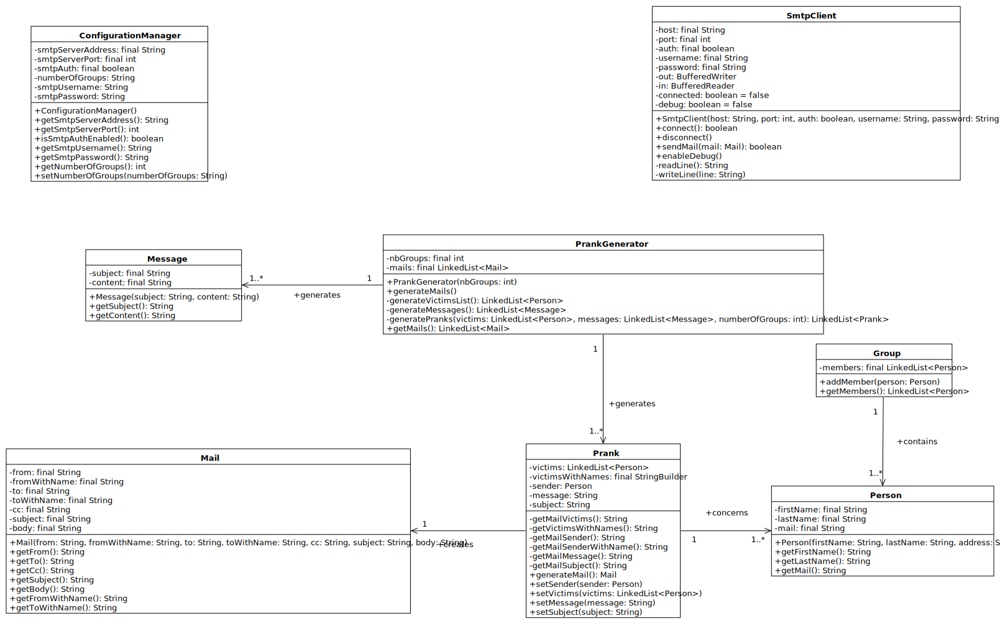

% Rapport labo 4 – SMTP
% Louis Hadrien; Mirabile Théo
% Cours d'API, HEIG-VD 2021

---

# Introduction et but

...

# Descriptif de l'implémentation

## Gestion de la configuration (classe `ConfigurationManager`)

...

## Client SMTP (classe `SmtpClient`)

...

## Personnes et groupes

...

## Modélisation des e-mails

...

## Génération des plaisanteries (classe `PrankGenerator`)

...

# Serveur de _mocking_

# Mode d'emploi

...

# Diagramme de classes

# Conclusion
